# 🌐 Monitoramento de Site com Nginx na AWS via Alertas no Telegram

Este projeto tem como finalidade a configuração de um ambiente Linux na AWS com um servidor web (Nginx) e a implementação de um sistema de monitoramento que verifica a disponibilidade do site e envia alertas via Telegram em caso de falhas.

## Índice

1. [Criação da VPC](#1-criação-da-vpc)
2. [Criação da Instância EC2](#2-criação-da-instância-ec2)
3. [Instalação e Configuração do Servidor Nginx](#3-instalação-e-configuração-do-servidor-nginx)
4. [Personalização da Página HTML](#4-personalização-da-página-html)
5. [Criação do Bot no Telegram](#5-criação-do-bot-no-telegram)
6. [Script de Monitoramento](#6-script-de-monitoramento)
7. [Agendamento com Crontab](#7-agendamento-com-crontab)
8. [Testes](#8-testes)
9. [Possíveis Melhorias Futuras](#9-possíveis-melhorias-futuras)

---

## 1. Criação da VPC

Procure por **VPC** na barra de pesquisa da AWS → **Create VPC**  
<p align="center">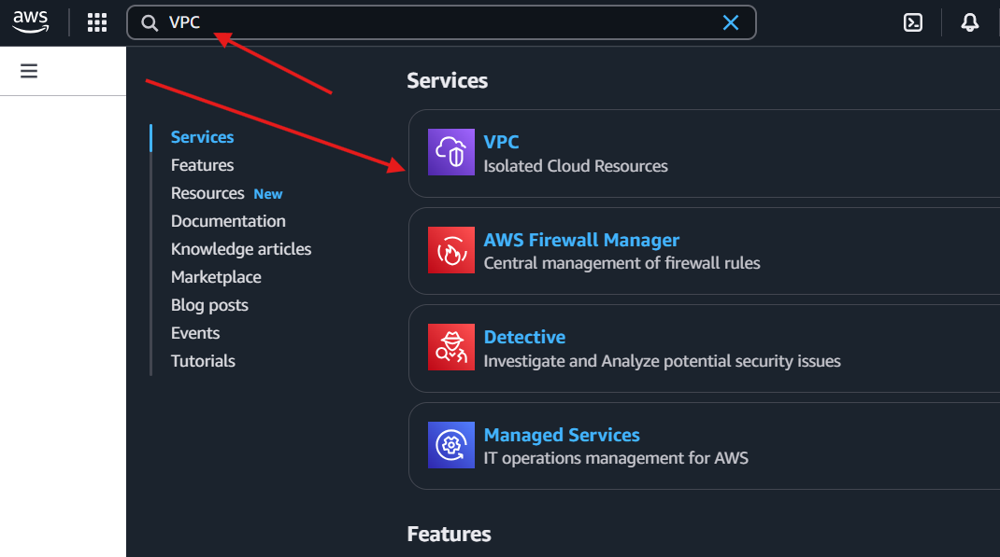</p>
<p align="center">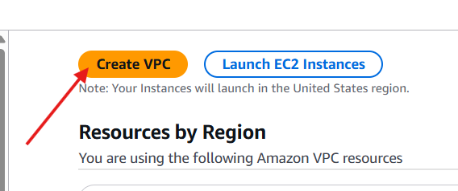</p>

Configurações da VPC:

<div align="center">
  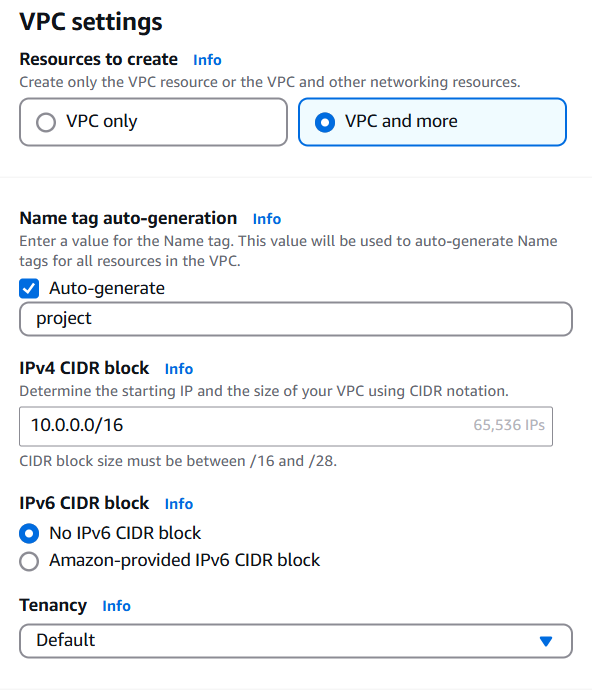
  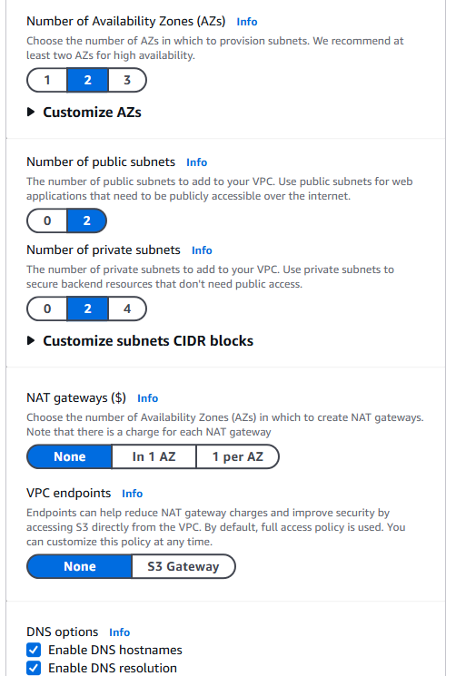
</div>

Clique em **Create VPC**.  
<p align="center">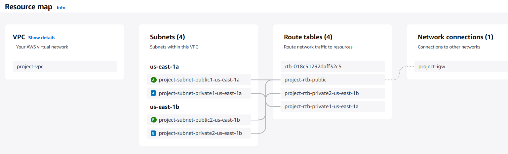</p>

---

## 2. Criação da Instância EC2

Procure por **EC2** na barra de pesquisa da AWS → **Launch Instance**

<div align="center">
  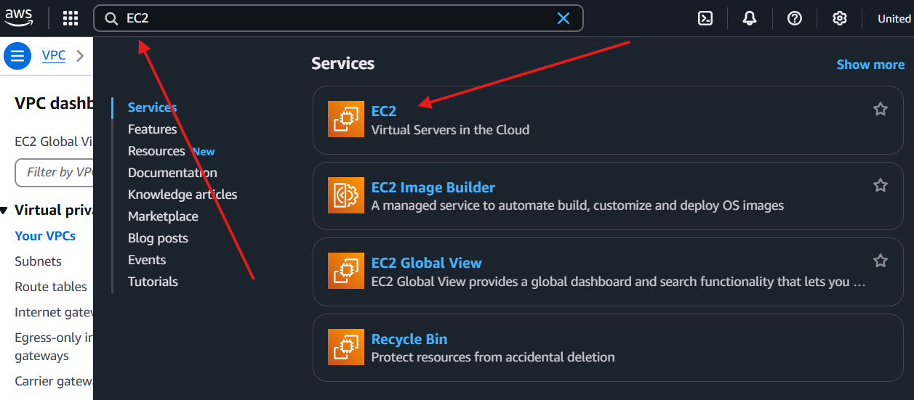
  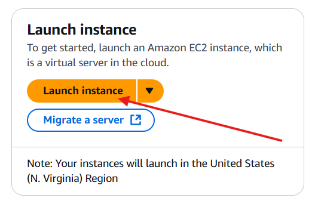
</div>

<p align="center"></p>
<p align="center">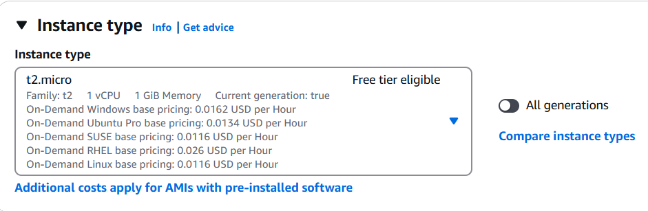</p>

Criação da chave SSH para login na instância:  
<p align="center">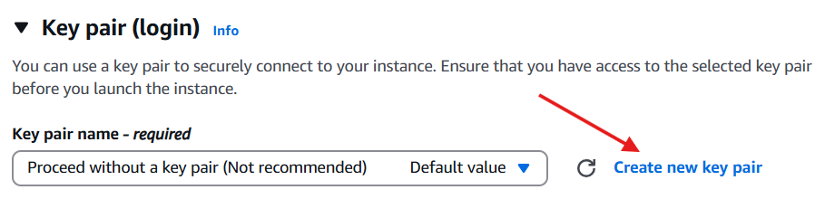</p>
<p align="center">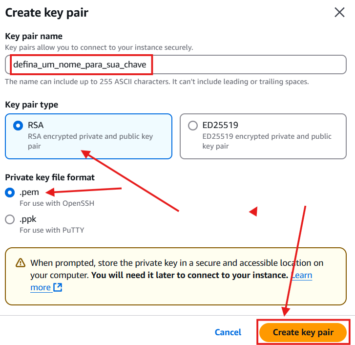</p>

Configurações de rede:
- Selecione a VPC criada
- Selecione uma sub-rede pública
- Ative a opção **Auto-assign public IP**
<p align="center">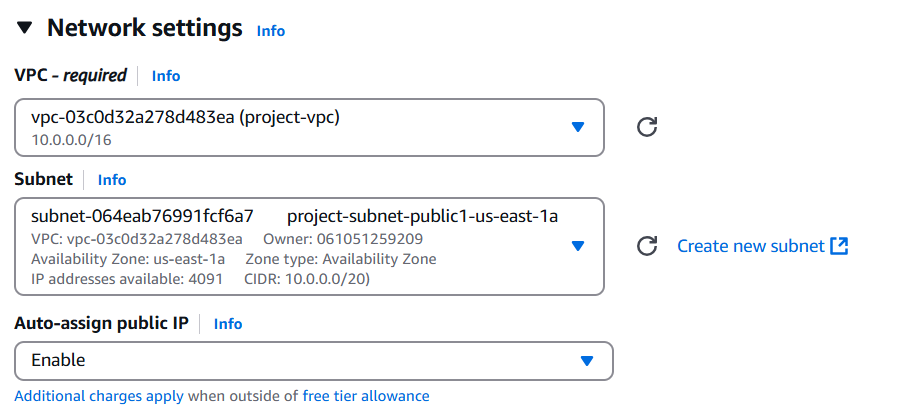</p>

Criação de um Security Group:
<p align="center">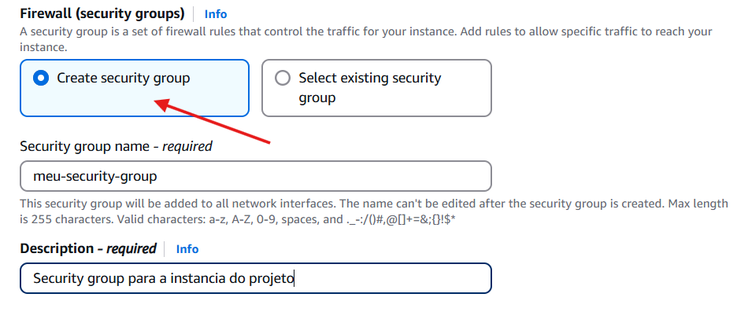</p>

Regras de segurança:
<p align="center">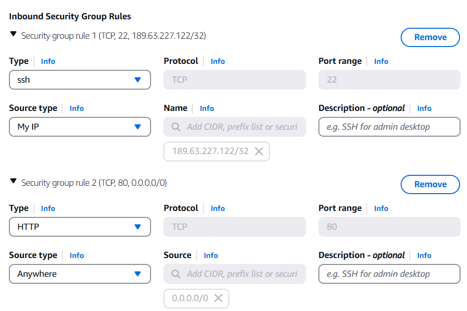</p>

Outras configurações e resumo:
<p align="center">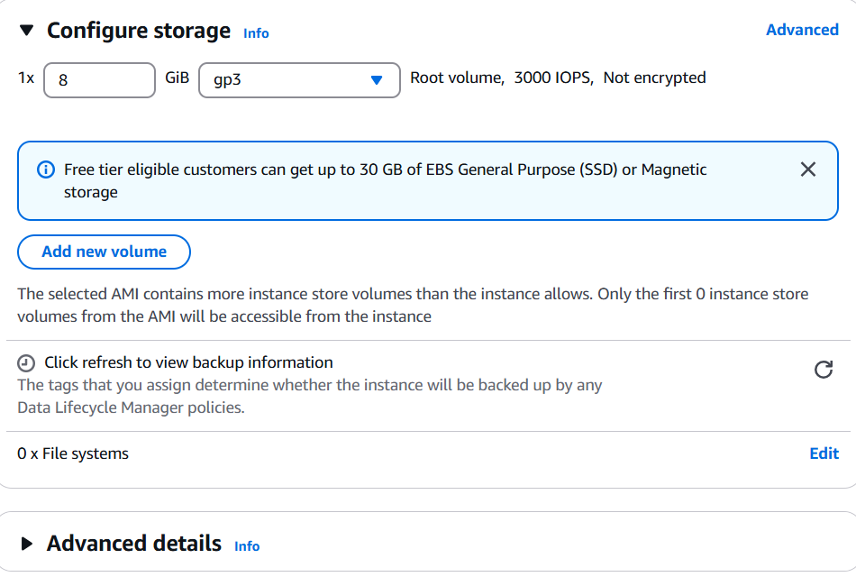</p>
<p align="center">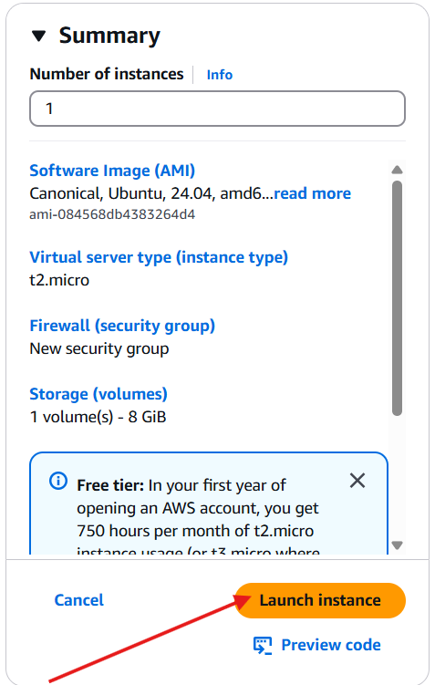</p>

IP público da instância:
<p align="center">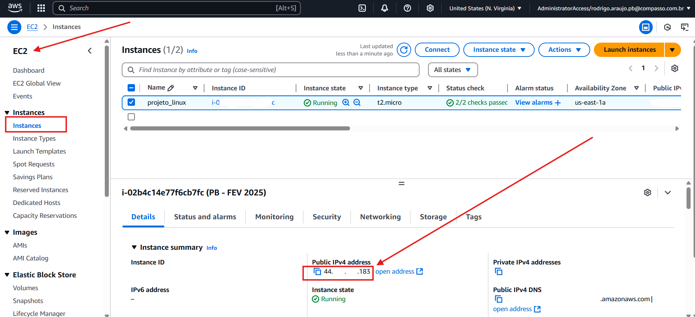</p>

Acessando a instância:

```bash
chmod 400 "seu-arquivo.pem"
ssh -i "seu-arquivo.pem" ubuntu@seu-ip-publico
```

---

## 3. Instalação e Configuração do Servidor Nginx

```bash
sudo apt update
sudo apt install nginx
```

<p align="center">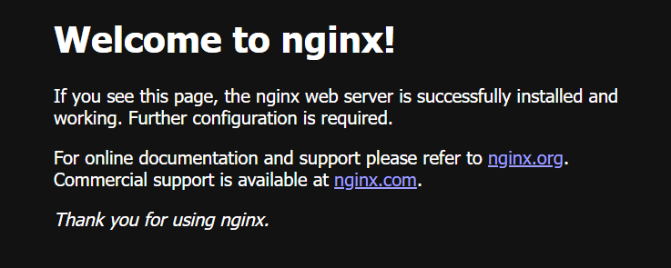</p>

---

## 4. Personalização da Página HTML

```bash
sudo nano /var/www/html/index.nginx-debian.html
```

Substitua pelo conteúdo abaixo:

```html
<!DOCTYPE html>
<html lang="pt-br">
<head>
  <meta charset="UTF-8">
  <title>Servidor Monitorado</title>
  <style>
    body {
      font-family: Arial, sans-serif;
      background: linear-gradient(to bottom, #f0f4f8, #d9e2ec);
      display: flex;
      flex-direction: column;
      align-items: center;
      justify-content: center;
      height: 100vh;
      margin: 0;
    }
    .container {
      background-color: #ffffff;
      border-radius: 12px;
      padding: 40px;
      box-shadow: 0 0 20px rgba(0,0,0,0.1);
      text-align: center;
    }
    h1 {
      color: #1e90ff;
      font-size: 32px;
      margin-bottom: 10px;
    }
    p {
      color: #333;
      font-size: 18px;
    }
    .tag {
      margin-top: 20px;
      font-size: 14px;
      color: #888;
    }
  </style>
</head>
<body>
  <div class="container">
    <h1>🚀 Servidor Monitorado com Sucesso!</h1>
    <p>Essa página está hospedada em uma instância EC2 na AWS com Nginx.</p>
    <div class="tag">Servidor Linux Monitorado • Mar/2025 </div>
  </div>
</body>
</html>
```


## 5. Criação do Bot no Telegram

1. Abra o Telegram e procure por `@BotFather`
2. Envie `/start` e depois `/newbot`
3. Defina nome e username para seu bot

<p align="center">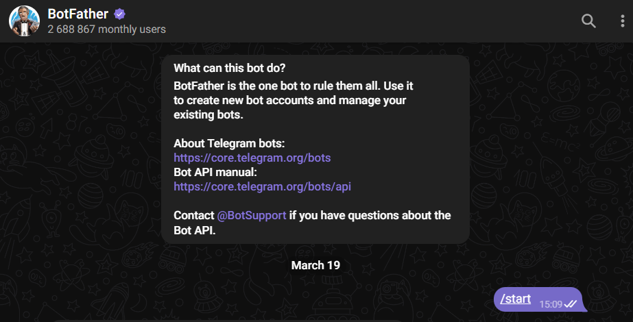</p>
<p align="center">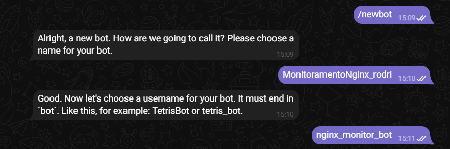</p>
<p align="center">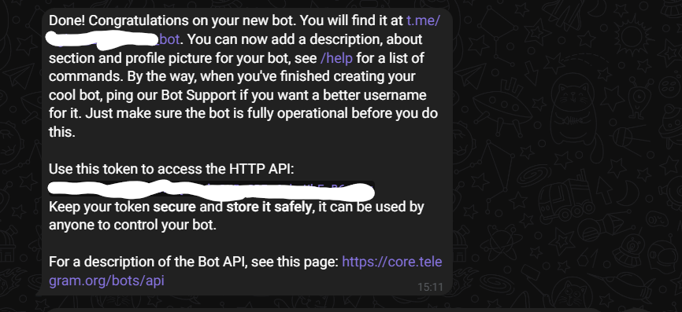</p>

Para obter o `chat_id`:
1. Envie qualquer mensagem para seu bot
2. No navegador, acesse:
```
https://api.telegram.org/botSEU_TOKEN/getUpdates
```
3. O `chat_id` estará no JSON de resposta.

---

## 6. Script de Monitoramento

Crie o arquivo do script:

```bash
sudo nano /usr/local/bin/monitoramento.sh
```

Cole o conteúdo abaixo:

```bash
#!/bin/bash
# Script de monitoramento do site local (localhost) com alerta via Telegram

# URL a ser monitorada
URL="http://localhost"
TOKEN="SEU_TOKEN_AQUI"
CHAT_ID="SEU_CHAT_ID_AQUI"
LOG="/home/ubuntu/monitoramento.log"

STATUS=$(curl -s -o /dev/null -w "%{http_code}" $URL)

if [ "$STATUS" -ne 200 ]; then
  echo "$(date '+%Y-%m-%d %H:%M:%S') - Site fora do ar (status $STATUS)" >> $LOG
  curl -s -X POST https://api.telegram.org/bot$TOKEN/sendMessage \
    -d chat_id=$CHAT_ID \
    -d text="🚨 ALERTA: O servidor Nginx está fora do ar! Código: $STATUS"
else
  echo "$(date '+%Y-%m-%d %H:%M:%S') - OK (status $STATUS)" >> $LOG
fi
```

Dê permissão de execução:

```bash
sudo chmod +x /usr/local/bin/monitoramento.sh
```

---

## 7. Agendamento com Crontab

```bash
crontab -e
```

Adicione a linha:

```bash
* * * * * /usr/local/bin/monitoramento.sh
```

---

## 8. Testes

### Parar o Nginx:

```bash
sudo systemctl stop nginx
```

### Verificar o alerta no Telegram:
<p align="center">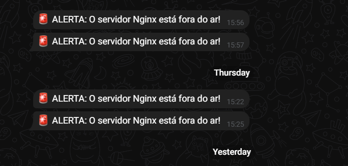</p>

### Verificar o conteúdo do log:

```bash
cat /home/ubuntu/monitoramento.log
```

Saída:

```bash
2025-03-27 02:30:20 - OK (status 200)
2025-03-27 02:36:01 - Site fora do ar (status 000)
2025-03-27 02:37:01 - Site fora do ar (status 000)
2025-03-27 02:38:01 - OK (status 200)
```

---

## 9. Possíveis Melhorias Futuras

Como aprimoramento, seria interessante automatizar toda a configuração da instância via **User Data**, garantindo que o Nginx, a página HTML e o script de monitoramento já sejam iniciados assim que a máquina for criada. Outra melhoria viável seria a criação de um template em **CloudFormation** para provisionar toda a infraestrutura de forma reproduzível e padronizada.

---

